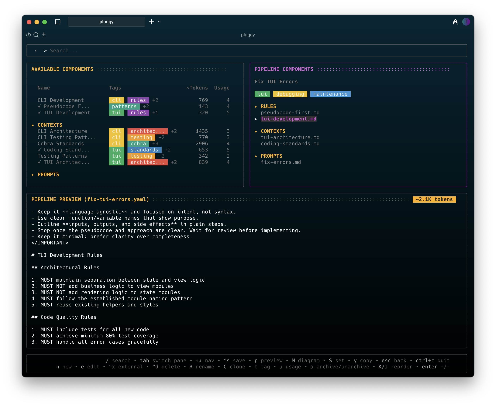
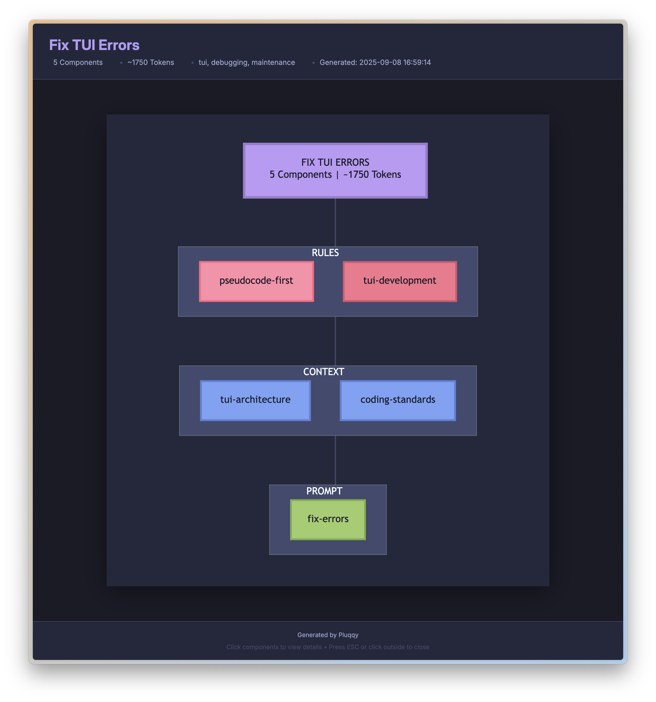

# Pluqqy

Build and manage minimal viable context for your AI coding assistant from your terminal.

Pluqqy lets you create reusable components (contexts, prompts, and rules) and combine them into pipelines. When you set a pipeline, it generates a PLUQQY.md (configurable) file that contains all your composed instructions.

In Claude Code or other AI coding tools, just reference @PLUQQY.md instead of copying and pasting prompts. Need different instructions? Set a different pipeline - the file updates automatically, but you keep referencing the same @PLUQQY.md.

This approach keeps your context minimal and focused - only including what's relevant for the current task. Both you and the AI work from the same single source of truth, eliminating confusion about which instructions are active while preserving valuable context window space.




<br>

## Features

| Feature                 | Description                                                                  |
| ----------------------- | ---------------------------------------------------------------------------- |
| **TUI**                 | Clean, intuitive terminal interface                                          |
| **Tagging**             | Organize and categorize components and pipelines with colored tags           |
| **Search**              | Search engine with field-based queries (tag:api, type:prompt)                |
| **Built-in Editor**     | Minimal editor for quick edits with undo, paste cleaning, and token counting |
| **Live Preview**        | See your composed pipeline as you build                                      |
| **Pipeline Visualizer** | Generate HTML-based interactive Mermaid diagrams of your pipelines           |
| **Clipboard Copy**      | Copy composed pipeline content directly to clipboard with `y` key            |

<br>

## Installation

```bash
git clone https://github.com/pluqqy/pluqqy-cli
cd pluqqy-cli
make install
```

This will build and install `pluqqy` to `$GOPATH/bin` or `$HOME/go/bin` (if GOPATH is not set).

<br>

### Updating

To update to the latest version:

```bash
cd pluqqy-cli
make update
```

Or manually:

```bash
git pull
make install
```

<br>

## Usage

### Initialize a new project

```bash
pluqqy init
```

This creates the following structure:

```
.pluqqy/
├── pipelines/
├── components/
│   ├── contexts/
│   ├── prompts/
│   └── rules/
├── archive/
│   ├── pipelines/
│   └── components/
│       ├── contexts/
│       ├── prompts/
│       └── rules/
├── tmp/              # For pipeline-generated output files
└── .gitignore        # Ignores tmp directory
```

<br>

### Launch the TUI

```bash
pluqqy
```

<br>

### TUI Commands

#### Main List View

| Key           | Action                                                             |
| ------------- | ------------------------------------------------------------------ |
| `Tab`         | Switch between pipelines and components panes                      |
| `↑↓` or `j/k` | Navigate items                                                     |
| `/`           | Enter search mode (use `^a` for archived, `^t` to cycle types)     |
| `e`           | Edit component in built-in editor / Edit pipeline in builder       |
| `^x`          | Edit component with external editor (components pane only)         |
| `t`           | Edit tags for selected component or pipeline                       |
| `n`           | Create new pipeline/component (uses enhanced editor for content)   |
| `a`           | Archive pipeline/component (with confirmation)                     |
| `^d`          | Delete pipeline/component (with confirmation)                      |
| `M`           | Generate interactive Mermaid diagram for selected pipeline         |
| `S`           | Set selected pipeline (generates PLUQQY.md, customizable filename) |
| `y`           | Copy composed pipeline content to clipboard (pipelines pane only)  |
| `s`           | Open settings editor                                               |
| `p`           | Toggle preview pane                                                |
| `^c`          | Quit (double ^c to confirm)                                        |

<br>

#### Pipeline Builder

| Key            | Action                                                                    |
| -------------- | ------------------------------------------------------------------------- |
| `Tab`          | Switch between panes (available components, pipeline components, preview) |
| `↑↓`           | Navigate items                                                            |
| `/`            | Enter search mode (use `^a` for archived, `^t` to cycle types)            |
| `Enter`        | Add/remove component (toggles)                                            |
| `n`            | Create new component                                                      |
| `e`            | Edit component in built-in editor                                         |
| `^x`           | Edit component with external editor                                       |
| `K/J` or `^↑↓` | Reorder pipeline components (move up/down)                                |
| `p`            | Toggle preview pane                                                       |
| `^s`           | Save pipeline                                                             |
| `S`            | Save and set as active pipeline                                           |
| `y`            | Copy composed pipeline content to clipboard                               |
| `Esc`          | Back to main list (with unsaved changes confirmation)                     |

<br>

#### Creating New Components

When creating a new component (press `n` in the components pane):

1. **Select Type**: Choose between Context, Prompt, or Rules
2. **Enter Name**: Provide a descriptive name for your component
3. **Edit Content**: Opens the enhanced editor with all features available:
   - Multi-line editing with line numbers
   - File references (`@` to insert)
   - Undo/Redo support (`^z`)
   - External editor integration (`^x`)
   - Save (`^s`) or cancel (`Esc`)

#### Component Editor (Enhanced Editor)

The enhanced editor provides a full-featured editing experience for both creating new components and editing existing ones.

<br>

**Editor Features:**

| Feature             | Description                                                                              |
| ------------------- | ---------------------------------------------------------------------------------------- |
| **Paste Cleaning**  | Automatically cleans copied content from TUI borders, line numbers, and terminal prompts |
| **Undo Support**    | `^z` to undo recent changes (maintains history of last 10 changes)                       |
| **Token Counter**   | Token guestimation displayed in the header                                               |
| **Status Bar**      | Shows save status, line/word count, and cursor position                                  |
| **File References** | Insert references to other files with `@` key                                            |

<br>

**Keyboard Shortcuts:**

| Key           | Action                                          |
| ------------- | ----------------------------------------------- |
| Type directly | Enter content in the editor                     |
| `↑↓`          | Navigate through content                        |
| `^z`          | Undo last change                                |
| `^d`          | Clear all content                               |
| `^l`          | Clean pasted content (removes TUI artifacts)    |
| `^s`          | Save component                                  |
| `^x`          | Open in external editor (for extensive editing) |
| `@`           | Insert file reference                           |
| `Esc`         | Cancel (with unsaved changes confirmation)      |

**Note:** This editor is intentionally minimal. For writing new components from scratch or making substantial edits, press `^x` to use your configured external editor (vim, VS Code, etc.)

<br>

#### Tag Editor

| Key           | Action                                                                                         |
| ------------- | ---------------------------------------------------------------------------------------------- |
| `Tab`         | Switch between current tags pane and available tags cloud                                      |
| `Enter`       | Add tag (from input field or tag cloud)                                                        |
| `←/→`         | Navigate tags for selection                                                                    |
| `^d`          | Remove tag from current item (main pane) / Delete from registry (tag cloud, with confirmation) |
| `^s`          | Save tag changes                                                                               |
| `^t`          | Reload tags                                                                                    |
| `Esc`         | Cancel without saving                                                                          |
| Type directly | Add new tags with autocomplete suggestions                                                     |

<br>

## Pipeline Visualizer

Pluqqy can generate interactive HTML-based Mermaid diagrams to visualize your pipeline structure:



### How to Use

1. Select any pipeline in the main list view
2. Press `M` to generate an interactive diagram
3. The diagram opens automatically in your default browser

<br>

### Features

| Feature                  | Description                                                 |
| ------------------------ | ----------------------------------------------------------- |
| **Interactive Tooltips** | Click on any component to see its full content and metadata |
| **Visual Organization**  | Components grouped by type (Contexts, Prompts, Rules)       |
| **Responsive Design**    | Diagrams scale to fit your browser window                   |
| **Export Ready**         | Save or print diagrams for documentation                    |

<br>

### Diagram Structure

The visualizer creates a flowchart showing:

- Pipeline name and total component count at the top
- Components organized into subgraphs by type
- Color coding: Contexts (blue), Prompts (green), Rules (red)

<br>

### Storage

Generated diagrams are saved in `.pluqqy/tmp/diagrams/` with timestamped filenames for easy reference.

<br>

## Tagging System

Pluqqy includes a tagging system to help organize and find your components and pipelines:

<br>

### Tag Features

| Feature              | Description                                                    |
| -------------------- | -------------------------------------------------------------- |
| **Color-Coded Tags** | Each tag gets a unique color for easy visual identification    |
| **Tag Registry**     | Central registry (`.pluqqy/tags.yaml`) stores tag metadata     |
| **Tag Editor**       | Interface for managing tags                                    |
| **Usage Tracking**   | See how many components/pipelines use each tag before deletion |
| **Autocomplete**     | Smart suggestions as you type based on existing tags           |

<br>

### Tag Storage

| Location       | Description                                                        |
| -------------- | ------------------------------------------------------------------ |
| **Components** | Tags stored in YAML frontmatter at the top of markdown files       |
| **Pipelines**  | Tags stored in the `tags` field of the YAML file                   |
| **Registry**   | Optional tag descriptions and custom colors in `.pluqqy/tags.yaml` |

<br>

### Search Capabilities

The built-in search engine supports powerful queries with keyboard shortcuts:

| Query                      | Description                   |
| -------------------------- | ----------------------------- |
| `tag:api`                  | Find items with the "api" tag |
| `type:prompt`              | Find all prompt components    |
| `type:context`             | Find all context components   |
| `type:rule`                | Find all rule components      |
| `type:pipeline`            | Find all pipelines            |
| `status:archived`          | Show all archived items       |
| `tag:api AND type:context` | Combine filters               |
| `content:"error handling"` | Full-text search in content   |

**Search Shortcuts:**

| Key   | Action                                                           |
| ----- | ---------------------------------------------------------------- |
| `/`   | Activate search mode                                             |
| `^a`  | Toggle archived filter (adds/removes `status:archived`)          |
| `^t`  | Cycle type filter (All → Pipelines → Prompts → Contexts → Rules) |
| `Esc` | Clear search and exit search mode                                |

Note: In Pipeline Builder, `^t` cycles through component types only (skips pipelines).

<br>

## UI Features

| Feature               | Description                                                                                |
| --------------------- | ------------------------------------------------------------------------------------------ |
| **Token Counter**     | Shows estimated token count in the preview pane with color-coded status (green/yellow/red) |
| **Tag Display**       | Tags shown as colored chips in component and pipeline lists                                |
| **Scrollable Panes**  | All panes support smooth scrolling for long content                                        |
| **Help Footer**       | Context-sensitive help text at the bottom of each screen                                   |
| **Responsive Layout** | Adapts to terminal size with proper content wrapping                                       |

<br>

## Output

The `set` command generates a `PLUQQY.md` file in your project root. This naming convention is intentional:

| Benefit                     | Description                                                               |
| --------------------------- | ------------------------------------------------------------------------- |
| **Non-conflicting**         | Won't overwrite common files like `AGENT.md` or `CLAUDE.md`               |
| **Claude Code Integration** | Simply reference `@PLUQQY.md` in Claude Code to load your entire pipeline |
| **Pipeline Agnostic**       | No need to remember specific pipeline names                               |
| **Chainable**               | Easily reference and combine multiple pipelines in Claude Code sessions   |
| **Customizable**            | Change the default filename in settings (press `s` from main view)        |

Yes, I know, the world already has plenty of AGENT.md, CLAUDE.md, and README.md files. Adding PLUQQY.md might feel like contributing more noise. The good news is you don’t have to call it PLUQQY.md. You can name it whatever you like (AGENT.md, WIZARD.md, BANANA.md, PLUQQYSUX.md), and you can customize exactly where Pluqqy generates it.

The file contains sections in your configured order:

- `CONTEXT` - Combined context components
- `PROMPTS` - Combined prompt components
- `IMPORTANT RULES` - Combined rules components

**Tip for teams**: To keep `PLUQQY.md` tracked in git but ignore local changes:

```bash
git update-index --skip-worktree PLUQQY.md
```

This lets each developer use different pipelines without creating commit noise.

<br>

## Example

1. Initialize project: `pluqqy init`
2. Launch TUI: `pluqqy`
3. Press `n` to create new pipeline
4. Name it "my-assistant"
5. Add components using the builder
6. Press `^s` to save
7. Press `S` to set the pipeline
8. Check `PLUQQY.md` for the composed output


<br>

## Configuration

### Settings Editor

Pluqqy includes a built-in settings editor accessible from the TUI. Press `s` from the main list view to customize:

- **Output Settings**
  - Default filename for generated output (default: `PLUQQY.md`)
  - Export path for pipeline output files (default: `./` - your project root)
  - Output path for pipeline-generated files (default: `.pluqqy/tmp/`)

- **Formatting Options**
  - Toggle section headings in output
  - Reorder sections using `J/K` keys
  - Edit section types and headings

Changes take effect immediately upon saving with `S`.

<br>

### External Editor

Pluqqy uses your system's `$EDITOR` environment variable to determine which external editor to use. Set it in your shell configuration (`.bashrc`, `.zshrc`, etc.):

```bash
# For vim users
export EDITOR=vim

# For nano users
export EDITOR=nano

# For VS Code users
export EDITOR="code --wait"

# For Cursor users
export EDITOR="cursor --wait"

# For Windsurf users
export EDITOR="windsurf --wait"

# For Zed users
export EDITOR="zed -w"

# For Sublime Text users
export EDITOR="subl -w"
```

**Important notes:**

- GUI editors (VS Code, Cursor, Windsurf, Zed, Sublime) require a "wait" flag to block until the file is closed
- Different editors use different wait flags: `--wait` for VS Code/Cursor/Windsurf, `-w` for Zed/Sublime
- After setting `$EDITOR`, reload your shell config: `source ~/.zshrc` (or `~/.bashrc`)
- Test your setting by running: `echo $EDITOR`

**How External Editing Works:**

1. Press `^x` in the enhanced editor to open your external editor
2. A status message appears: "Editing in external editor - save your changes and close the editor window/tab to return here and continue"
3. Make your changes and save the file in the external editor
4. Close the editor window/tab to return to Pluqqy:
   - **Terminal editors** (vim, nano): Exit normally and you'll return immediately
   - **GUI editors** (VS Code, Zed, etc.): Close the specific tab or window to return
5. Your changes will be automatically reloaded in Pluqqy

<br>

## Requirements

- Go 1.19 or higher (for building)
- Terminal with UTF-8 support

<br>

## License

MIT
