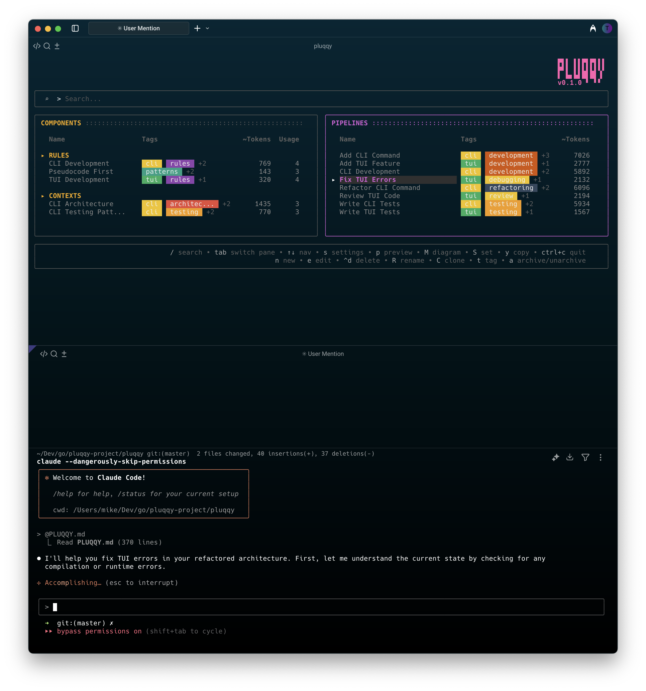

# Pluqqy

Build and manage minimal viable context for your AI coding assistant from your terminal.

Pluqqy lets you create reusable components (contexts, prompts, and rules) and combine them into pipelines. When you set a pipeline, it generates a PLUQQY.md (configurable) file that contains all your composed instructions.

In Claude Code or other AI coding tools, just reference @PLUQQY.md instead of copying and pasting prompts. Need different instructions? Set a different pipeline - the file updates automatically, but you keep referencing the same @PLUQQY.md.

This approach keeps your context minimal and focused - only including what's relevant for the current task. Both you and the AI work from the same single source of truth, eliminating confusion about which instructions are active while preserving valuable context window space.


<br>

## Features

| Feature                 | Description                                                                                   |
| ----------------------- | --------------------------------------------------------------------------------------------- |
| **TUI**                 | Clean, intuitive terminal interface                                                           |
| **CLI Commands**        | Full-featured command-line interface for automation and scripting                             |
| **Tagging**             | Organize and categorize components and pipelines with colored tags                            |
| **Search**              | Search engine with field-based queries (tag:api, type:prompt)                                 |
| **Built-in Editor**     | Minimal editor for quick edits with undo, paste cleaning, and token counting                  |
| **Live Preview**        | See your composed pipeline as you build                                                       |
| **Pipeline Visualizer** | Generate HTML-based interactive Mermaid diagrams of your pipelines                            |
| **Clipboard Copy**      | Copy composed pipeline content directly to clipboard (TUI: `y` key, CLI: `clipboard` command) |

<br>

## Installation

```bash
git clone https://github.com/pluqqy/pluqqy-terminal
cd pluqqy-terminal
make install
```

This will build and install `pluqqy` to `$GOPATH/bin` or `$HOME/go/bin` (if GOPATH is not set).

<br>

### Updating

To update to the latest version:

```bash
cd pluqqy-terminal
make update
```

Or manually:

```bash
git pull
make install
```

<br>

## Usage

### Initialize a new project

```bash
pluqqy init
```

This creates the following structure:

```
.pluqqy/
├── pipelines/
├── components/
│   ├── contexts/
│   ├── prompts/
│   └── rules/
├── archive/
│   ├── pipelines/
│   └── components/
│       ├── contexts/
│       ├── prompts/
│       └── rules/
├── tmp/              # For pipeline-generated output files
└── .gitignore        # Ignores tmp directory
```

<br>

### Add Example Components and Pipelines

```bash
# Add general development examples
pluqqy examples

# Add specific category examples
pluqqy examples web       # Web development (React, APIs)
pluqqy examples ai        # AI assistant optimization
pluqqy examples claude    # CLAUDE.md migration tool

# Add all examples
pluqqy examples all

# List available examples without installing
pluqqy examples --list
```

The `examples` command installs pre-built components and pipelines that demonstrate best practices and common patterns. All examples are prefixed with `example-` to distinguish them from your own components.

<br>

### Launch the TUI

```bash
pluqqy
```

<br>

## CLI Commands

Pluqqy provides a comprehensive set of CLI commands for managing pipelines and components without the TUI. All commands support multiple output formats (`--output json|yaml`) and global flags (`--quiet`, `--yes`, `--no-color`).

### Pipeline Commands

#### Set Active Pipeline or Component

```bash
# Set a pipeline as active (generates output file)
pluqqy set cli-development

# Set a specific component as active
pluqqy set contexts/api-docs
pluqqy set prompts/user-story

# Set with custom output filename
pluqqy set cli-development --output-file MY_PROMPT.md
pluqqy set contexts/api-docs --output-file CONTEXT.md
```

#### List Items

```bash
# List all items (pipelines and components)
pluqqy list

# List specific types
pluqqy list pipelines
pluqqy list components
pluqqy list contexts
pluqqy list prompts
pluqqy list rules

# Show only archived items
pluqqy list --archived

# Show file paths
pluqqy list --paths

# Output as JSON or YAML
pluqqy list -o json
pluqqy list pipelines -o yaml
```

#### Show Content

```bash
# Show composed pipeline output (what the AI sees)
pluqqy show cli-development

# Show component content
pluqqy show api-docs
pluqqy show contexts/api-docs

# Show with metadata header
pluqqy show cli-development --metadata

# Output pipeline/component structure as JSON/YAML
pluqqy show cli-development -o json
pluqqy show api-docs -o yaml
```

#### Export Content

```bash
# Export composed pipeline to stdout
pluqqy export cli-development

# Export component to stdout
pluqqy export contexts/api-docs

# Export to file
pluqqy export cli-development --file output.md
pluqqy export prompts/user-story --file prompt.md

# Export structure as JSON/YAML
pluqqy export cli-development -o json
pluqqy export contexts/api-docs -o yaml --file context.yaml
```

#### Copy to Clipboard

```bash
# Copy pipeline content to clipboard
pluqqy clipboard cli-development

# Copy component content to clipboard
pluqqy clipboard contexts/api-docs
pluqqy clipboard prompts/user-story

# Using aliases
pluqqy clip cli-development
pluqqy copy contexts/api-docs
```

### Component Commands

#### Create Components

```bash
# Create a new component (opens editor)
pluqqy create context api-docs
pluqqy create prompt user-story
pluqqy create rule security

# Create with tags
pluqqy create context api-docs --tags api,documentation
```

#### Edit Components

```bash
# Edit a component in your external editor
pluqqy edit api-docs
pluqqy edit prompts/user-story

# Handle ambiguous names by specifying type
pluqqy edit contexts/api-docs
```

#### Archive & Restore

```bash
# Archive a component or pipeline
pluqqy archive api-docs
pluqqy archive my-pipeline

# Archive without confirmation
pluqqy archive old-component -y

# Restore from archive
pluqqy restore api-docs
pluqqy restore my-pipeline -y

# List archived items
pluqqy list --archived
```

#### Delete Items

```bash
# Delete with confirmation
pluqqy delete old-component

# Force delete without confirmation
pluqqy delete old-component --force

# Skip confirmation with -y flag
pluqqy delete old-component -y

# Delete specific type when ambiguous
pluqqy delete contexts/old-component
```

#### Show Component Usage

```bash
# Show which pipelines use a component
pluqqy usage coding-standards

# Specify component type for disambiguation
pluqqy usage prompts/greeting
pluqqy usage contexts/api-docs

# Include archived pipelines in the search
pluqqy usage coding-standards --all

# Output as JSON or YAML
pluqqy usage api-docs -o json
pluqqy usage prompts/greeting -o yaml
```

### Search Commands

```bash
# Search with query syntax
pluqqy search "tag:api"
pluqqy search "type:prompt"
pluqqy search "content:authentication"

# Complex searches
pluqqy search "tag:api AND type:context"
pluqqy search "status:archived"

# Output search results as JSON
pluqqy search "tag:api" -o json
```

### Global Flags

All commands support these global flags:

```bash
# Output format (text, json, yaml)
pluqqy list -o json
pluqqy show api-docs -o yaml

# Quiet mode (suppress non-error output)
pluqqy set cli-development -q

# Skip confirmations
pluqqy delete old-component -y
pluqqy archive api-docs --yes

# Disable colored output
pluqqy list --no-color

# Verbose output
pluqqy search "tag:api" -v
```

### Handling Ambiguous Names

When components share the same filename across different types:

```bash
# If you have both prompts/api.md and contexts/api.md
pluqqy show api              # Error: multiple components found
pluqqy show prompts/api      # Shows the prompt version
pluqqy show contexts/api     # Shows the context version

# Same applies to all commands
pluqqy edit prompts/api
pluqqy archive contexts/api
pluqqy delete prompts/api
```

### Examples

```bash
# Typical workflow
pluqqy init                                    # Initialize project
pluqqy create context project-architecture     # Create a context
pluqqy create prompt implement-feature         # Create a prompt
pluqqy create rule coding-standards           # Create rules
pluqqy list components                        # See all components
pluqqy set contexts/project-architecture      # Set just the context
pluqqy clipboard prompts/implement-feature    # Copy prompt to clipboard

# Pipeline workflow
pluqqy list pipelines                         # See available pipelines
pluqqy show cli-development --metadata        # Preview with metadata
pluqqy set cli-development                    # Set as active
pluqqy clipboard cli-development              # Copy to clipboard

# Maintenance workflow
pluqqy list --archived                        # See archived items
pluqqy archive old-component -y               # Archive without confirmation
pluqqy restore old-component                  # Restore from archive
pluqqy delete contexts/deprecated --force     # Force delete
```

<br>

### TUI Commands

#### Main List View

| Key           | Action                                                             |
| ------------- | ------------------------------------------------------------------ |
| `Tab`         | Switch between pipelines and components panes                      |
| `↑↓` or `j/k` | Navigate items                                                     |
| `/`           | Enter search mode (use `^a` for archived, `^t` to cycle types)     |
| `e`           | Edit component in built-in editor / Edit pipeline in builder       |
| `^x`          | Edit component with external editor (components pane only)         |
| `t`           | Edit tags for selected component or pipeline                       |
| `u`           | Show which pipelines use the selected component (components pane)  |
| `n`           | Create new pipeline/component (uses enhanced editor for content)   |
| `a`           | Archive pipeline/component (with confirmation)                     |
| `^d`          | Delete pipeline/component (with confirmation)                      |
| `M`           | Generate interactive Mermaid diagram for selected pipeline         |
| `S`           | Set selected pipeline (generates PLUQQY.md, customizable filename) |
| `y`           | Copy composed pipeline content to clipboard (pipelines pane only)  |
| `s`           | Open settings editor                                               |
| `p`           | Toggle preview pane                                                |
| `^c`          | Quit (double ^c to confirm)                                        |

<br>

#### Pipeline Builder

| Key            | Action                                                                    |
| -------------- | ------------------------------------------------------------------------- |
| `Tab`          | Switch between panes (available components, pipeline components, preview) |
| `↑↓`           | Navigate items                                                            |
| `/`            | Enter search mode (use `^a` for archived, `^t` to cycle types)            |
| `Enter`        | Add/remove component (toggles)                                            |
| `n`            | Create new component                                                      |
| `e`            | Edit component in built-in editor                                         |
| `^x`           | Edit component with external editor                                       |
| `u`            | Show which pipelines use the selected component                           |
| `K/J` or `^↑↓` | Reorder pipeline components (move up/down)                                |
| `p`            | Toggle preview pane                                                       |
| `^s`           | Save pipeline                                                             |
| `S`            | Save and set as active pipeline                                           |
| `y`            | Copy composed pipeline content to clipboard                               |
| `Esc`          | Back to main list (with unsaved changes confirmation)                     |

<br>

#### Creating New Components

When creating a new component (press `n` in the components pane):

1. **Select Type**: Choose between Context, Prompt, or Rules
2. **Enter Name**: Provide a descriptive name for your component
3. **Edit Content**: Opens the enhanced editor with all features available:
   - Multi-line editing with line numbers
   - File references (`@` to insert)
   - Undo/Redo support (`^z`)
   - External editor integration (`^x`)
   - Save (`^s`) or cancel (`Esc`)

#### Component Editor (Enhanced Editor)

The enhanced editor provides a simple editing experience for both creating new components and editing existing ones.

<br>

**Editor Features:**

| Feature             | Description                                                                              |
| ------------------- | ---------------------------------------------------------------------------------------- |
| **Paste Cleaning**  | Automatically cleans copied content from TUI borders, line numbers, and terminal prompts |
| **Undo Support**    | `^z` to undo recent changes (maintains history of last 10 changes)                       |
| **Token Counter**   | Token guestimation displayed in the header                                               |
| **Status Bar**      | Shows save status, line/word count, and cursor position                                  |
| **File References** | Insert references to other files with `@` key                                            |

<br>

**Keyboard Shortcuts:**

| Key            | Action                                          |
| -------------- | ----------------------------------------------- |
| Type directly  | Enter content in the editor                     |
| `↑↓`           | Navigate through content                        |
| `^z` / `M-z`\* | Undo last change                                |
| `^k` / `M-k`\* | Clear all content (useful before pasting)       |
| `^l` / `M-l`\* | Clean pasted content (removes TUI artifacts)    |
| `^s` / `M-s`\* | Save component                                  |
| `^x` / `M-x`\* | Open in external editor (for extensive editing) |
| `@`            | Insert file reference                           |
| `Esc`          | Cancel (with unsaved changes confirmation)      |

\*On Linux/Windows, use Alt key combinations (M-) to avoid terminal conflicts

**Note:** This editor is intentionally minimal. For writing new components from scratch or making substantial edits, press `^x` / `M-x` to use your configured external editor (vim, VS Code, etc.)

<br>

### OS-Specific Keyboard Shortcuts

Pluqqy automatically adapts keyboard shortcuts based on your operating system to avoid terminal conflicts:

#### macOS

All standard shortcuts work as expected (`^s` for save, `^d` for delete, etc.)

#### Linux

Some shortcuts are remapped to avoid terminal signal conflicts:

| Standard | Linux Alternative | Reason                                      |
| -------- | ----------------- | ------------------------------------------- |
| `^s`     | `M-s` (Alt+S)     | Avoids XOFF (terminal output pause)         |
| `^d`     | `M-d` (Alt+D)     | Avoids EOF signal that closes terminal      |
| `^z`     | `M-z` (Alt+Z)     | Avoids SIGTSTP (process suspension)         |
| `^x`     | `M-x` (Alt+X)     | Avoids conflict with terminal cut operation |
| `^k`     | `M-k` (Alt+K)     | Avoids readline kill-line                   |
| `^l`     | `M-l` (Alt+L)     | Avoids terminal clear screen                |
| `^a`     | `M-a` (Alt+A)     | Avoids readline beginning-of-line           |
| `^t`     | `M-t` (Alt+T)     | Avoids readline transpose                   |

**Note:** `M-` is the standard terminal notation for Alt key combinations.

**Linux Tip:** To use standard Ctrl shortcuts instead, disable terminal flow control:

```bash
stty -ixon  # Add to your .bashrc or .zshrc
```

#### Windows

Similar remappings for better compatibility:

| Standard    | Windows Alternative | Reason                 |
| ----------- | ------------------- | ---------------------- |
| `^s`        | `M-s` (Alt+S)       | Consistency with Linux |
| `^d`        | `M-d` (Alt+D)       | Consistency with Linux |
| `^x`        | `M-x` (Alt+X)       | Consistency with Linux |
| `^z`        | `M-z` (Alt+Z)       | Consistency with Linux |
| `^k`        | `M-k` (Alt+K)       | Consistency with Linux |
| `^l`        | `M-l` (Alt+L)       | Consistency with Linux |
| `^a`        | `M-a` (Alt+A)       | Consistency with Linux |
| `^t`        | `M-t` (Alt+T)       | Consistency with Linux |
| `shift+tab` | `backtab`           | Terminal compatibility |

The help footer in the TUI always shows the correct shortcuts for your current OS.

<br>

#### Tag Editor

| Key            | Action                                                                                         |
| -------------- | ---------------------------------------------------------------------------------------------- |
| `Tab`          | Switch between current tags pane and available tags cloud                                      |
| `Enter`        | Add tag (from input field or tag cloud)                                                        |
| `←/→`          | Navigate tags for selection                                                                    |
| `^d` / `M-d`\* | Remove tag from current item (main pane) / Delete from registry (tag cloud, with confirmation) |
| `^s` / `M-s`\* | Save tag changes                                                                               |
| `^t` / `M-t`\* | Reload tags                                                                                    |
| `Esc`          | Cancel without saving                                                                          |
| Type directly  | Add new tags with autocomplete suggestions                                                     |

\*On Linux/Windows, use Alt key combinations (M-) to avoid terminal conflicts

<br>

## Pipeline Visualizer

Pluqqy can generate interactive HTML-based Mermaid diagrams to visualize your pipeline structure:


### How to Use

1. Select any pipeline in the main list view
2. Press `M` to generate an interactive diagram
3. The diagram opens automatically in your default browser

<br>

### Features

| Feature                  | Description                                                 |
| ------------------------ | ----------------------------------------------------------- |
| **Interactive Tooltips** | Click on any component to see its full content and metadata |
| **Visual Organization**  | Components grouped by type (Contexts, Prompts, Rules)       |
| **Responsive Design**    | Diagrams scale to fit your browser window                   |
| **Export Ready**         | Save or print diagrams for documentation                    |

<br>

### Diagram Structure

The visualizer creates a flowchart showing:

- Pipeline name and total component count at the top
- Components organized into subgraphs by type
- Color coding: Contexts (blue), Prompts (green), Rules (red)

<br>

### Storage

Generated diagrams are saved in `.pluqqy/tmp/diagrams/` with timestamped filenames for easy reference.

<br>

## Tagging System

Pluqqy includes a tagging system to help organize and find your components and pipelines:

<br>

### Tag Features

| Feature              | Description                                                    |
| -------------------- | -------------------------------------------------------------- |
| **Color-Coded Tags** | Each tag gets a unique color for easy visual identification    |
| **Tag Registry**     | Central registry (`.pluqqy/tags.yaml`) stores tag metadata     |
| **Tag Editor**       | Interface for managing tags                                    |
| **Usage Tracking**   | See how many components/pipelines use each tag before deletion |
| **Autocomplete**     | Smart suggestions as you type based on existing tags           |

<br>

### Tag Storage

| Location       | Description                                                        |
| -------------- | ------------------------------------------------------------------ |
| **Components** | Tags stored in YAML frontmatter at the top of markdown files       |
| **Pipelines**  | Tags stored in the `tags` field of the YAML file                   |
| **Registry**   | Optional tag descriptions and custom colors in `.pluqqy/tags.yaml` |

<br>

### Search Capabilities

The built-in search engine supports powerful queries with keyboard shortcuts:

| Query                      | Description                   |
| -------------------------- | ----------------------------- |
| `tag:api`                  | Find items with the "api" tag |
| `type:prompt`              | Find all prompt components    |
| `type:context`             | Find all context components   |
| `type:rule`                | Find all rule components      |
| `type:pipeline`            | Find all pipelines            |
| `status:archived`          | Show all archived items       |
| `tag:api type:context`     | Combine filters               |
| `content:"error handling"` | Full-text search in content   |

**Search Shortcuts:**

| Key            | Action                                                           |
| -------------- | ---------------------------------------------------------------- |
| `/`            | Activate search mode                                             |
| `^a` / `M-a`\* | Toggle archived filter (adds/removes `status:archived`)          |
| `^t` / `M-t`\* | Cycle type filter (All → Pipelines → Prompts → Contexts → Rules) |
| `Esc`          | Clear search and exit search mode                                |

\*On Linux/Windows, use Alt key combinations (M-) to avoid terminal conflicts

Note: In Pipeline Builder, `^t` / `M-t` cycles through component types only (skips pipelines).

<br>

## UI Features

| Feature                | Description                                                                                |
| ---------------------- | ------------------------------------------------------------------------------------------ |
| **Token Counter**      | Shows estimated token count in the preview pane with color-coded status (green/yellow/red) |
| **Tag Display**        | Tags shown as colored chips in component and pipeline lists                                |
| **Scrollable Panes**   | All panes support smooth scrolling for long content                                        |
| **Help Footer**        | Context-sensitive help text at the bottom of each screen                                   |
| **Responsive Layout**  | Adapts to terminal size with proper content wrapping                                       |
| **OS-Aware Shortcuts** | Keyboard shortcuts automatically adapt to your operating system for better compatibility   |

<br>

## Output

The `set` command generates a `PLUQQY.md` file in your project root. This naming convention is intentional:

| Benefit                     | Description                                                               |
| --------------------------- | ------------------------------------------------------------------------- |
| **Non-conflicting**         | Won't overwrite common files like `AGENTS.md` or `CLAUDE.md`              |
| **Claude Code Integration** | Simply reference `@PLUQQY.md` in Claude Code to load your entire pipeline |
| **Pipeline Agnostic**       | No need to remember specific pipeline names                               |
| **Chainable**               | Easily reference and combine multiple pipelines in Claude Code sessions   |
| **Customizable**            | Change the default filename in settings (press `s` from main view)        |

Yes, I know, the world already has plenty of AGENTS.md, CLAUDE.md, and README.md files. Adding PLUQQY.md might feel like contributing more noise. The good news is you don’t have to call it PLUQQY.md. You can name it whatever you like (AGENTS.md, WIZARD.md, BANANA.md, PLUQQYSUX.md), and you can customize exactly where Pluqqy generates it.

The file contains sections in your configured order:

- `CONTEXT` - Combined context components
- `PROMPTS` - Combined prompt components
- `RULES` - Combined rules components

**Tip for teams**: To keep `PLUQQY.md` tracked in git but ignore local changes:

```bash
git update-index --skip-worktree PLUQQY.md
```

This lets each developer use different pipelines without creating commit noise.

<br>

## Examples Library

Pluqqy includes a built-in library of example components and pipelines to help you get started quickly. These examples demonstrate useful patterns and approaches we've found helpful when working with AI coding assistants.

### Available Example Categories

| Category    | Description                 | Includes                                                          |
| ----------- | --------------------------- | ----------------------------------------------------------------- |
| **general** | General-purpose development | Feature implementation, bug fixing, code review, testing patterns |
| **web**     | Web development             | React components, REST APIs, database schemas, accessibility      |
| **ai**      | AI assistant optimization   | Codebase overview, concise responses, code-first approach         |
| **claude**  | CLAUDE.md migration         | Tools to convert existing CLAUDE.md files into Pluqqy components  |

### Using Examples

```bash
# Install examples for a specific category
pluqqy examples general

# Install all examples
pluqqy examples all

# List available examples without installing
pluqqy examples --list

# Force overwrite existing examples
pluqqy examples general --force
```

### Example Components Structure

All example components include:

- **Placeholders**: Replace `{{PLACEHOLDER}}` values with your project-specific information
- **Clear documentation**: Each component explains its purpose and usage
- **Practical patterns**: Approaches that have worked well in real projects
- **Reusability**: Designed to work across different projects

### CLAUDE.md Migration

If you have an existing `CLAUDE.md` file, use the special distiller pipeline:

```bash
# Install the CLAUDE.md distiller
pluqqy examples claude

# Set the distiller pipeline
pluqqy set example-claude-distiller

# In your AI assistant, provide your CLAUDE.md content
# The pipeline will help extract and convert it to Pluqqy components
```

The distiller will:

- Parse your CLAUDE.md structure
- Extract contexts (documentation, architecture)
- Extract prompts (task instructions)
- Extract rules (constraints, standards)
- Create appropriate pipelines
- Replace specific values with reusable placeholders

### Customizing Examples

1. **Replace placeholders**: Update `{{PROJECT_NAME}}`, `{{LANGUAGE}}`, etc.
2. **Modify content**: Adapt examples to your specific needs
3. **Remove prefix**: Rename files to remove the `example-` prefix when ready
4. **Create variations**: Use examples as templates for project-specific components

<br>

## Example

1. Initialize project: `pluqqy init`
2. Launch TUI: `pluqqy`
3. Press `n` to create new pipeline
4. Name it "my-assistant"
5. Add components using the builder
6. Press `^s` to save
7. Press `S` to set the pipeline
8. Check `PLUQQY.md` for the composed output



<br>

## Configuration

### Settings Editor

Pluqqy includes a built-in settings editor accessible from the TUI. Press `s` from the main list view to customize:

- **Output Settings**
  - Default filename for generated output (default: `PLUQQY.md`)
  - Export path for pipeline output files (default: `./` - your project root)
  - Output path for pipeline-generated files (default: `.pluqqy/tmp/`)

- **Formatting Options**
  - Toggle section headings in output
  - Reorder sections using `J/K` keys
  - Edit section types and headings

Changes take effect immediately upon saving with `^s` (or `M-s` on Linux/Windows).

<br>

### External Editor

Pluqqy uses your system's `$EDITOR` environment variable to determine which external editor to use. Set it in your shell configuration (`.bashrc`, `.zshrc`, etc.):

```bash
# For vim users
export EDITOR=vim

# For nano users
export EDITOR=nano

# For VS Code users
export EDITOR="code --wait"

# For Cursor users
export EDITOR="cursor --wait"

# For Windsurf users
export EDITOR="windsurf --wait"

# For Zed users
export EDITOR="zed -w"

# For Sublime Text users
export EDITOR="subl -w"
```

**Important notes:**

- GUI editors (VS Code, Cursor, Windsurf, Zed, Sublime) require a "wait" flag to block until the file is closed
- Different editors use different wait flags: `--wait` for VS Code/Cursor/Windsurf, `-w` for Zed/Sublime
- After setting `$EDITOR`, reload your shell config: `source ~/.zshrc` (or `~/.bashrc`)
- Test your setting by running: `echo $EDITOR`

**How External Editing Works:**

1. Press `^x` in the enhanced editor to open your external editor
2. A status message appears: "Editing in external editor - save your changes and close the editor window/tab to return here and continue"
3. Make your changes and save the file in the external editor
4. Close the editor window/tab to return to Pluqqy:
   - **Terminal editors** (vim, nano): Exit normally and you'll return immediately
   - **GUI editors** (VS Code, Zed, etc.): Close the specific tab or window to return
5. Your changes will be automatically reloaded in Pluqqy

<br>

## Requirements

- Go 1.19 or higher (for building)
- Terminal with UTF-8 support

<br>

## License

MIT
